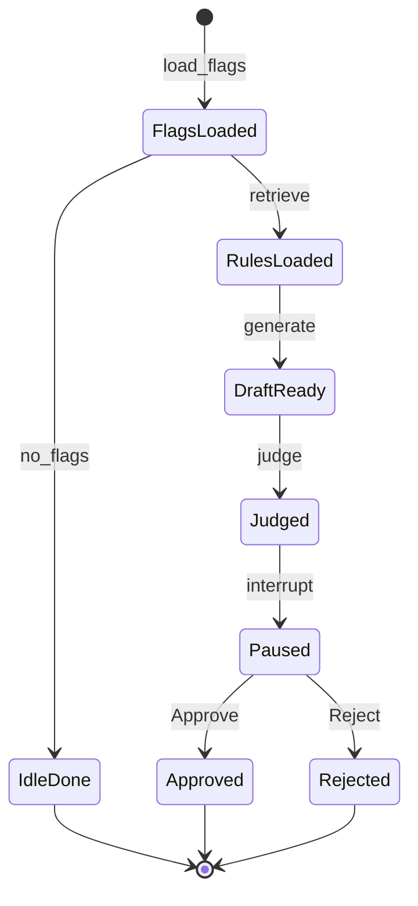

# FinOptima — Interview notes

## Pitch (30–60 seconds)

FinOptima is a FinOps helper. **SQL** finds two money problems: cloud budget overspend and idle SaaS. **Hybrid RAG** finds which written rule applies. **LiteLLM** writes a short memo around pasted engine numbers (OpenAI → Groq → Gemini). A **second LLM** checks that no dollars were invented. A **SqliteSaver** pause waits for a human **Approve / Reject**. This is a linear **StateGraph**, not a LangGraph supervisor.

**One rule:** the database owns the money. The LLM does not invent dollars.

---

## What we detect (honest)

| Problem | Detected? | How |
|---------|-----------|-----|
| Cloud overspend | Yes | >15% or >$5k over monthly limit |
| Idle SaaS (shelfware) | Yes | No login ≥ 30 days; P1 if ARR > $10k |
| Seats / duplicates / shadow IT / renewals | No | Need other feeds; policies mention them; engine does not fake them |

Demo seed: US Operations **2026-08** cloud actual **19200** vs limit **8000**. Several high-ARR idle tools (RedundantPM, AnaplanShelf, GongIdle, …).

---

## Flow (as built)

```text
Run audit (FastAPI)
  → load_flags     engine + email mask     NO LLM
  → idle?          no flags → END
  → retrieve       hybrid RAG (MiniLM + Chroma + keyword)
  → generate       LiteLLM memo (skip if no RAG / no keys)
  → judge          second LLM: invented numbers? (UI: “FinOptima reviewed…”)
  → INTERRUPT      SqliteSaver → data/graph_checkpoints.sqlite
  → Approve/Reject apply_decision → END
```



**Judge ≠ Approve.** Judge = “no numbers invented.” Approve = you make the memo official for this run.

---

## Folders

| Path | Owns |
|------|------|
| `data/` | `finoptima.db` (or Postgres), `graph_checkpoints.sqlite` |
| `policies/` | Five markdown handbooks (~26 Rule chunks) |
| `src/db/` | Schema, seed, `open_db()` (Postgres if up, else SQLite) |
| `src/audit/` | `engine.py` — flags only, no LLM |
| `src/agents/` | `rag.py`, `redact.py`, `llm.py`, `graph.py` |
| `src/api/` | FastAPI + `templates/index.html` (only UI) |
| `evals/` | Pytest replay + checkpoint + LLM helpers |

Streamlit (`src/ui/`) was removed. Site is FastAPI only.

---

## Parts 1–10 (short)

**1 — Skeleton**  
Separate money (`audit` + SQL) from agents (`agents`) from HTTP (`api`).

**2 — Database**  
`schema.sql` + `build_db.py`. Three entities, budgets, cloud lines, SaaS contracts. Rebuild: `python src/db/build_db.py`. Postgres: `setup_postgres.sql` then same seed; engine falls back to SQLite if Postgres is down.

**3 — Policies**  
`spending_guidelines` (1.x), `audit_framework` (2.x), `vendor_and_shadow_it` (3.x), `intercompany_and_fx` (4.x), `control_exceptions` (5.x). Rule 2.1 vs 3.1 both say “30 consecutive days” so RAG must pick audit vs procurement.

**4 — Engine**  
`get_cloud_flags` / `get_saas_flags`. Math in SQL/`HAVING`. Run: `python src/audit/engine.py`.

**5 — First UI**  
Was Streamlit; **gone**. Humans use `http://127.0.0.1:8000`.

**6 — Hybrid RAG**  
`src/agents/rag.py`: keyword + vector, RRF merge. Local MiniLM. Graph `retrieve` node calls it. Standalone: `python src/agents/rag.py`.

**7 — Functions + redact**  
Engine returns dicts. `redact.py` masks `owner_email` before state/LLM. No GPT in this step.

**8 — LangGraph**  
`src/agents/graph.py`: load_flags → retrieve → generate → judge → interrupt → apply_decision. State fields: `cloud_flags`, `saas_flags`, `policy_hits`, `memo`, `llm_model`, `judge_ok`, `decision`.

**9 — LangSmith + evals**  
LangSmith = camera (traces). Pytest = teacher (`evals/test_pipeline.py` replays to pause, asserts engine `$` still in memo). Judge is a **graph node**, not a LangSmith UI grader. Project name: `finoptima`.

**10 — FastAPI + Docker**  
Website `/` + JSON `/audit`, `/docs`. Compose: API waits on healthy Postgres. `GET /health` → `money_db`, `llm_providers`.

**Extras (built)**  
- LiteLLM fallbacks: `src/agents/llm.py`  
- SqliteSaver checkpointer: pause survives API restart  
- Site copy: “FinOptima reviewed this draft: no numbers were invented…”

---

## Run locally

```text
python src/db/build_db.py
set PYTHONPATH=src
uvicorn api.main:app --reload --app-dir src --host 127.0.0.1 --port 8000
```

Open **http://127.0.0.1:8000**.  
`.env`: `OPENAI_API_KEY` (optional Groq/Gemini), LangSmith keys if tracing, `DATABASE_URL` if using Postgres.

```text
python -m pytest evals/ -v
docker compose up --build
```

---

## Interview lines

- *SQL owns actual/limit/idle days; GPT only writes English around pasted facts.*  
- *Linear StateGraph with HITL interrupt — not a multi-agent supervisor.*  
- *Hybrid RAG: keyword + embeddings so lookalike “30 days” rules still disambiguate.*  
- *Judge checks faithfulness; human Approve is the control.*  
- *SqliteSaver so Run and Approve can be two HTTP requests (and survive restart).*  
- *We detect idle SaaS and cloud overspend; we do not pretend to detect shadow IT without AP data.*

---

## Not built (on purpose)

Public hosting, login/password, seat-waste / duplicate / shadow-IT detectors, reject-reason log, emailing the memo on Approve.
